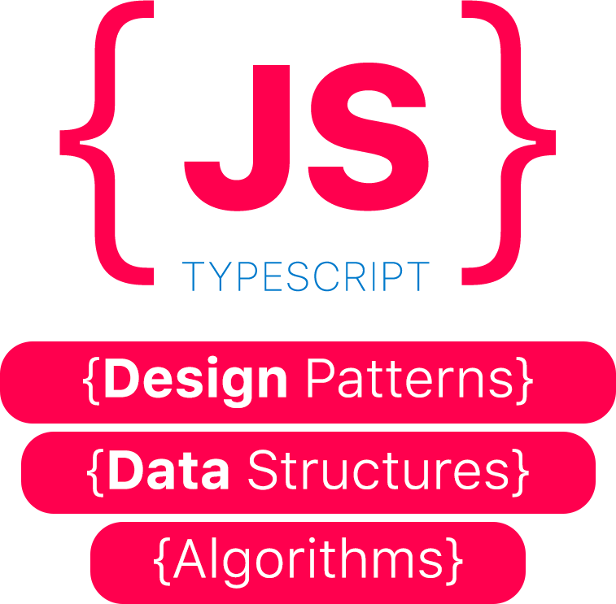

<p align="center"> 

 

# [](https://travis-ci.com/ihuseynoff/js-algorithms-data-structures) [](https://github.com/ihuseynoff/js-algorithms-data-structures/graphs/commit-activity) [](LICENSE)

</p>
 
Collection of most used data structures, design patterns, and algorithms written in TypeScript. Each algorithm has 
a separate Readme file with an explanation of the algorithm, well-commented source code, test cases implemented in Jest, 
and online demo for playing around.

⚠️ This repository is created only for education purpose. Therefore, using it for commercial purpose is forbidden.

## 🗃 Data Structures

In computer science, a data structure is a data organization, management and storage format that enables efficient 
access and modification. More precisely, a data structure is a collection of data values, the relationships among them, 
and the functions or operations that can be applied to the data.

<details>
<summary>
    View Contents 
</summary>
<p>

#### Basic Data Structures                              

- `B` [Linked List](data-structures/linked-list): with/without tail pointer      
- `B` [Stack](data-structures/stack)                                            
- `B` [Queue](data-structures/queue)                                                  
- `B` [Hash Table](data-structures/hash-table)             

#### Tree                                               
- `B` [Heap](data-structures/heap): min/max version                                                                 
- `B` Priority Queue                                                          

 
</p>
</details>

## 🛠 Algorithms 

An algorithm is an unambiguous specification of how to solve a class of problems. It is a set of rules that precisely 
define a sequence of operations.
  
<details>
<summary>
    View Contents
</summary>
<p>

####  Sorting

 - Bubble Sort
 - Selection Sort
 - Insertion Sort
 - Heap Sort
 - Merge Sort
 - QuickSort 
 - Counting Sort 
 - Radix Sort 
  </p>
</details>
 
 
 
## 🎨 Design Patterns

In software engineering, a design pattern is a general repeatable solution to a commonly occurring problem in software
design. A design pattern isn't a finished design that can be transformed directly into code. It is a description or 
template for how to solve a problem that can be used in many different situations.
 
<details>
 <summary>
  View Contents
 </summary>
 <p>
 

### Creational design patterns

- Singleton
- Prototype
- Abstract Factory
 
### Structural design patterns

- Adapter
- Bridge
- Decorator
- Facade 
- Proxy

### Behavioral design patterns

- 
 </p>
</details>
 
## 💻 Getting Started

<details>
<summary>
View Contents
</summary>
<p>

### Prerequisites

To clone and run this application, you'll need Git and Node.js (which comes with npm) installed on your computer. 


### Installing
From your command line:

 ```text
# Clone this repository
$ git clone https://github.com/ihuseynoff/js-algorithms-data-structures.git
 
# Go into the repository
$ cd js-algorithms-data-structures

# Install dependencies
$ npm install

```

 
### Testing
```text
$ npm test
```
</p>
</details>
 
 
 
## 🤝 Contributing
<details>
 <summary>
    View Contents
 </summary>
 <p>
    Thanks for your interest in contributing! Read up on  guidelines for <a href="Contributing.md">Contributing</a>.
 </p>
</details>


## 🎓 License
<details>
 <summary>
    View Contents
 </summary>
 <p>
This project is licensed under the MIT License - see the <a href="LICENSE">LICENSE</a> file for details
 </p>
</details>
